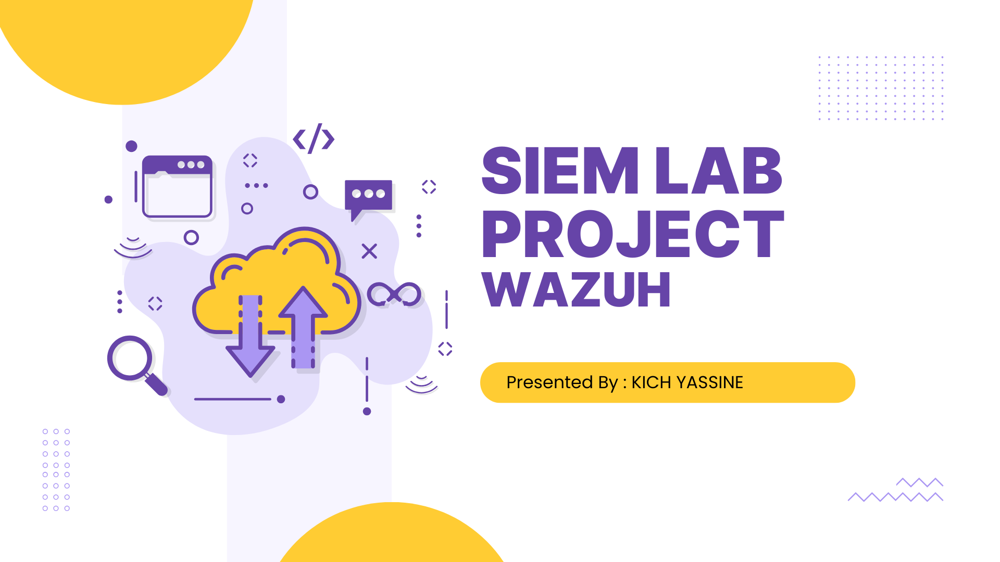

# 🔐 Atelier Sécurité des Endpoints et Supervision SIEM

## Étude de Cas Multi-OS (Linux & Windows)

---

## 📋 Informations Académiques

| Élément                 | Détail               |
| ----------------------- | -------------------- |
| **Professeur**          | Prof. Azeddine KHIAT |
| **Année Universitaire** | 2025/2026            |
| **Filière**             | GLSID                |
| **Date de Rendu**       | 07 janvier 2026      |

---

## 🎯 Objectifs du Projet

✅ **Déployer une plateforme SIEM complète** dans le Cloud (AWS)  
✅ **Intégrer des endpoints multi-OS** (Linux Ubuntu & Windows Server)  
✅ **Collecter et centraliser** les événements de sécurité  
✅ **Démontrer des scénarios d'attaque réalistes** (brute force, escalade de privilèges, etc.)  
✅ **Analyser les alertes** via tableau de bord SIEM/EDR  
✅ **Implémenter la détection de menaces** en temps réel

---

## 🏗️ Architecture du Système

### Infrastructure AWS

```
VPC (SIEM-Lab-VPC)
│
├─ Subnet: 10.0.32.0/24
│
├─ EC2-1: Wazuh-Server (Ubuntu 22.04 LTS)
│  ├─ IP Privée: 10.0.32.10
│  ├─ Rôle: Manager + Indexer + Dashboard
│  ├─ Type: t3.large
│  └─ Stockage: 30GB
│
├─ EC2-2: Linux-Client (Ubuntu 22.04)
│  ├─ IP Privée: 10.0.32.X
│  ├─ IP Publique: 3.230.21.137
│  ├─ Rôle: Endpoint avec agent Wazuh
│  ├─ Type: t2.micro/t3.micro
│  └─ Stockage: 8GB
│
└─ EC2-3: Windows-Client (Windows Server 2025)
   ├─ IP Privée: 10.0.32.Y
   ├─ Rôle: Endpoint Windows avec agent Wazuh + Sysmon
   ├─ Type: t2.medium
   └─ Stockage: 30GB
```

### Vue d'ensemble (diagramme)


### Flux de Communication

- **Agent → Manager** : 1514/TCP (collecte des logs)
- **Enrollment** : 1515/TCP (enregistrement des agents)
- **Dashboard Web** : 443/HTTPS (interface Wazuh)
- **SSH Access** : 22/TCP (management Linux)
- **RDP Access** : 3389/TCP (management Windows)

---

## 🛠️ Technologies Utilisées

| Technologie        | Version   | Rôle                      |
| ------------------ | --------- | ------------------------- |
| **Wazuh**          | 4.7.5     | SIEM + EDR                |
| **AWS EC2**        | -         | Infrastructure Cloud      |
| **Ubuntu**         | 22.04 LTS | OS Serveur + Client Linux |
| **Windows Server** | 2025      | Client Windows            |
| **Sysmon**         | 15+       | EDR enrichi (Windows)     |
| **OpenSearch**     | 2.x       | Backend Wazuh             |
| **Auditd**         | 3.x       | Audit logs Linux          |
| **MITRE ATT&CK**   | v14       | Framework détection       |

---

## 📚 Documentation

### 📖 Guides d'Installation

1. **[AWS Setup](install/aws_setup.md)** - Créer VPC, Subnets, Security Groups, EC2
2. **[Wazuh Server (CentOS)](install/wazuh_install_centos.md)** - Installation Wazuh All-in-One
3. **[Wazuh Agent - Windows](install/wazuh_agent_windows.md)** - Déploiement sur Windows
4. **[Wazuh Agent - Linux](install/wazuh_agent_linux.md)** - Déploiement sur Ubuntu

### 🔒 Configurations

- **[wazuh.yml](configs/wazuh.yml)** - Configuration serveur Wazuh
- **[sysmon.xml](configs/sysmon.xml)** - Configuration Sysmon (Windows EDR)
- **[firewall-rules.txt](configs/firewall-rules.txt)** - Règles Security Groups AWS

### 📊 Scénarios et Résultats

- **[SIEM Scenarios](docs/siem-scenarios.md)** - Tous les scénarios testés
- **[Screenshots](docs/)** - Captures des alertes Wazuh

---

## ⚡ Déploiement Rapide

### 1️⃣ Préparer AWS Learner Lab

```bash
# Créer VPC et Subnet
# Consulter: install/aws_setup.md

# VPC ID: vpc-059722f94a2b45028
# Subnet: SIEM-Lab-Subnet (10.0.32.0/24)
```

### 2️⃣ Installer Wazuh Server

```bash
# Sur EC2-1 (Ubuntu 22.04 - t3.large - 30GB)
ssh ubuntu@<WAZUH_SERVER_IP>

curl -sO https://packages.wazuh.com/4.7/wazuh-install.sh
sudo bash wazuh-install.sh -a

# À la fin: récupérer admin credentials
sudo tar -xf wazuh-install-files.tar
cat wazuh-install-files/wazuh-passwords.txt
```

### 3️⃣ Accéder au Dashboard

```
URL: https://<WAZUH_SERVER_IP>
Username: admin
Password: (voir wazuh-passwords.txt)
```

### 4️⃣ Déployer Agent Linux

```bash
# Via Dashboard Wazuh:
# Agents Management → Deploy new agent → Select "Linux"
# Copier et exécuter les commandes proposées sur EC2-2
```

### 5️⃣ Déployer Agent Windows

```powershell
# Via Dashboard Wazuh:
# Agents Management → Deploy new agent → Select "Windows"
# Télécharger le .msi et exécuter sur EC2-3 (Windows Server)

# Vérifier:
# Services → Wazuh Agent = Running
```

### 6️⃣ Générer des Événements de Sécurité

Voir [siem-scenarios.md](docs/siem-scenarios.md) pour les procédures exactes.

---

## 🔍 Scénarios SIEM/EDR Démontrés

### 🐧 Linux (SSH Brute Force)

```bash
# SSH failed attempts (10 fois avec mauvais mot de passe)
ssh fakeuser@<LINUX_CLIENT_IP>

# Résultat dans Wazuh:
# - Alertes "authentication_failed"
# - Source: /var/log/auth.log
# - Pattern: sshd
```

### 🪟 Windows (Failed Logon)

```powershell
# RDP failed attempts (2-5 tentatives)
# Résultat: Windows Security Event ID 4625

# Création utilisateur
net user labuser P@ssw0rd! /add
net localgroup administrators labuser /add

# Résultat: Event ID 4720 (user created)
```

### 📡 Sysmon (EDR avancée)

```
- Process creation tracking
- Network connections
- Registry modifications
- File integrity monitoring
```

---

## ✅ Résultats Attendus

| Événement       | Source             | Alert ID | Status      |
| --------------- | ------------------ | -------- | ----------- |
| SSH Brute Force | Linux (auth.log)   | 5710     | ✅ Détecté  |
| Failed Logon    | Windows (Security) | 4625     | ✅ Détecté  |
| User Creation   | Windows (Security) | 4720     | ✅ Détecté  |
| Sysmon Process  | Windows (Sysmon)   | 1        | ✅ Collecté |
| Sysmon Network  | Windows (Sysmon)   | 3        | ✅ Collecté |


## 🔐 Points de Sécurité Clés

### Security Groups AWS

```
Wazuh-Server SG:
  ✓ 22/TCP   → Votre IP (SSH)
  ✓ 443/TCP  → Votre IP (Dashboard)
  ✓ 1514/TCP → Clients SG (Agent communication)
  ✓ 1515/TCP → Clients SG (Enrollment)

Linux-Client SG:
  ✓ 22/TCP   → Votre IP (SSH)

Windows-Client SG:
  ✓ 3389/TCP → Votre IP (RDP)
```

### MITRE ATT&CK Mapping

| Scénario        | Technique         | ID    | Détection    |
| --------------- | ----------------- | ----- | ------------ |
| Brute Force SSH | Credential Access | T1110 | ✅ Wazuh     |
| Failed Logon    | Credential Access | T1078 | ✅ Event Log |
| User Creation   | Persistence       | T1136 | ✅ Event Log |
| Sysmon Process  | Execution         | T1059 | ✅ Sysmon    |
| Sysmon Network  | Command & Control | T1071 | ✅ Sysmon    |


## ✍️ Auteur

**Étudiant** : KICH YASSINE  
**Professeur** : Prof. Azeddine KHIAT  
**Date** : 07 Janvier 2026  
**Établissement** : ENSET

---

## 📄 Licence

Ce projet est fourni à titre pédagogique. Les configurations et scripts sont fournis tels quels.

---

**Last Updated** : 7 January 2026
